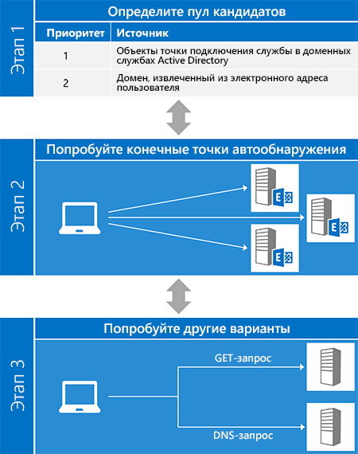
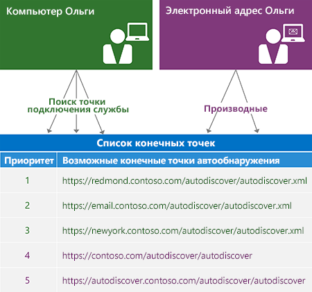
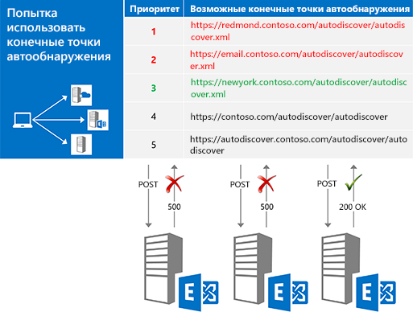

# Автообнаружение для ExchangeAutodiscover for Exchange

Информация, содержащаяся в этом документе, может относиться к функциям и продуктам предварительной версии и может претерпеть значительные изменения до окончательного коммерческого выпуска. Настоящий документ предоставляется "как есть" и служит только для информационных целей. Корпорация Майкрософт не предоставляет никаких гарантий, явных или подразумеваемых, в связи с этим документом Сведения о службе автообнаружения в Exchange.Learn about the Autodiscover service in Exchange.
  
Служба автообнаружения Exchange позволяет клиентскому приложению с легкостью настроиться практически без участия пользователя. Большинство пользователей знают свои адрес электронной почты и пароль, и с помощью этих сведений вы можете получить все остальные сведения, необходимые для начала работы. Для клиентов веб-служб Exchange (EWS) автообнаружение обычно используется, чтобы найти URL-адрес конечной точки EWS, но служба автообнаружения также может предоставлять сведения для настройки клиентов, использующих другие протоколы. Автообнаружение работает с клиентскими приложениями как за брандмауэрами, так и за их пределами, и будет работать в сценариях с лесом ресурсов или несколькими лесами.The Exchange Autodiscover service provides an easy way for your client application to configure itself with minimal user input. Most users know their email address and password, and with those two pieces of information, you can retrieve all the other details you need to get up and running. For Exchange Web Services (EWS) clients, Autodiscover is typically used to find the EWS endpoint URL, but Autodiscover can also provide information to configure clients that use other protocols. Autodiscover works for client applications that are inside or outside firewalls and will work in resource forest and multiple forest scenarios.
  
## Обзор процесса автообнаруженияOverview of the Autodiscover process

Процесс автообнаружения состоит из трех основных этапов. На первом этапе создается список потенциальных серверов автообнаружения, а на втором вы проверяете каждый сервер в списке, пока (при благоприятном исходе) не будет получен успешный ответ. Если ни один из кандидатов не подошел, вы переходите к третьему этапу, который представляет последнюю попытку найти конечную точку автообнаружения.The Autodiscover process essentially has three phases. In phase one, you generate a list of potential Autodiscover servers, and in phase two, you try each server in your list until you (hopefully) get a successful response. If none of your candidates worked out, you move on to phase three, which represents a "last ditch" attempt to find an Autodiscover endpoint.
  
Метод [ExchangeService.AutodiscoverUrl](http://msdn.microsoft.com/en-us/library/microsoft.exchange.webservices.data.exchangeservice.autodiscoverurl%28v=exchg.80%29.aspx) в управляемом API EWS реализует все три этапа, поэтому при использовании управляемого API EWS вам не нужно беспокоиться о реализации автообнаружения. На следующем рисунке показаны три этапа процесса автообнаружения.The [ExchangeService.AutodiscoverUrl](http://msdn.microsoft.com/en-us/library/microsoft.exchange.webservices.data.exchangeservice.autodiscoverurl%28v=exchg.80%29.aspx) method in the EWS Managed API implements all three phases of this process for you, so if you are using the EWS Managed API, you don't need to worry about implementing Autodiscover yourself. The following figure shows the three phases of the Autodiscover process. 
  
**Рисунок 1. Три этапа процесса автообнаружения****Figure 1. Three phases of the Autodiscover process**

  
### Этап 1. Определение пула кандидатовPhase 1: Defining the candidate pool

Прежде чем использовать службу автообнаружения, необходимо найти подходящий сервер автообнаружения для пользователя. К счастью, служба автообнаружения задает ограниченное количество мест для поиска. Если найдено несколько кандидатов, служба автообнаружения также определяет [способ создания и сортировки списка по приоритету](how-to-generate-a-list-of-autodiscover-endpoints.md).Before you can use Autodiscover, you have to locate the right Autodiscover server for your user. Luckily, Autodiscover defines a limited number of places for you to look. In the case where multiple candidates are found, Autodiscover also defines [a way to generate and prioritize the list](how-to-generate-a-list-of-autodiscover-endpoints.md).
  
**Таблица 1. Источники кандидатов на конечную точку автообнаружения****Table 1: Autodiscover endpoint candidate sources**

|**Место для поиска****Place to look**|**Результат поиска****What you'll find**|
|:-----|:-----|
|Доменные службы Active Directory (AD DS)Active Directory Domain Services (AD DS)    |Для клиентов, присоединенных к домену, поиск следует начинать отсюда. Exchange публикует объекты точек подключения службы (SCP) в AD DS, что позволяет направлять запросы автообнаружения на сайты Active Directory. Результаты [поиска SCP](how-to-find-autodiscover-endpoints-by-using-scp-lookup-in-exchange.md) должны находиться в начале списка кандидатов.  For domain-joined clients, this is the first place to look. Exchange publishes service connection point (SCP) objects in AD DS, which allows Autodiscover requests to be routed to servers based on Active Directory sites. The results of an [SCP lookup](how-to-find-autodiscover-endpoints-by-using-scp-lookup-in-exchange.md) should be at the top of your candidate list.    **Примечание**: поиска SCP недоступно для клиентов, не присоединенного к домену или, не имеющие доступа к серверам Active Directory.**NOTE**: SCP lookup isn't available for clients that are not joined to a domain or that do not have access to Active Directory servers. В этом случае следует пропустить поиска SCP.In this case, you should skip SCP lookup.  |
|Домен адреса электронной почты пользователяThe user's email address domain    | Служба автообнаружения задает две стандартных формы URL-адресов конечных точек, получаемых из доменной части адреса электронной почты пользователя:Autodiscover defines two standard endpoint URL forms that are derived from the domain portion of the user's email address:   `"https://" + domain + "/autodiscover/autodiscover" +  *fileExtension*`   `"https://autodiscover." + domain + "/autodiscover/autodiscover" +  *fileExtension*`    Значение  *fileExtension*  зависит от используемого метода автообнаружения, [SOAP](http://msdn.microsoft.com/library/61c21ea9-7fea-4f56-8ada-bf80e1e6b074%28Office.15%29.aspx) или [POX](http://msdn.microsoft.com/library/877152f0-f4b1-4f63-b2ce-924f4bdf2d20%28Office.15%29.aspx). Служба SOAP использует расширение файлов SVC, а POX использует XML.  The value of  *fileExtension*  depends on which Autodiscover access method you are using, [SOAP](http://msdn.microsoft.com/library/61c21ea9-7fea-4f56-8ada-bf80e1e6b074%28Office.15%29.aspx) or [POX](http://msdn.microsoft.com/library/877152f0-f4b1-4f63-b2ce-924f4bdf2d20%28Office.15%29.aspx). The SOAP service uses a ".svc" file extension; POX uses ".xml".    |
   
На следующем рисунке показано, как создать список конечных точек автообнаружения.The following figure shows how to generate an Autodiscover endpoint list.
  
**Рисунок 2. Процесс создания списка конечных точек автообнаружения****Figure 2. Process for generating an Autodiscover endpoint list**

  
### Этап 2. Проверка кандидатовPhase 2: Trying each candidate

После создания упорядоченного списка потенциальных кандидатов следует проверить каждого из них, [отправив запрос на URL-адрес](how-to-get-user-settings-from-exchange-by-using-autodiscover.md) и проверив результаты, как показано на рисунке 3. Когда вы получите успешный ответ, все готово!After you generate an ordered list of potential candidates, the next step is try each one in the list by [sending a request to the URL](how-to-get-user-settings-from-exchange-by-using-autodiscover.md) and validating the results, as shown in Figure 3. When you get a successful response, you're done! 
  
**Рисунок 3. Проверка кандидатов на конечные точки по порядку****Figure 3. Trying each endpoint candidate in order**

  
Прежде чем отправлять запрос кандидату, убедитесь в его надежности. Помните, что вы отправляете учетные данные пользователя, поэтому важно убедиться, что вы сообщаете их только надежным серверам. Как минимум, следует убедиться:Before you send a request to a candidate, make sure it is trustworthy. Remember that you're sending the user's credentials, so it's important to make sure that you're only sharing them with a server you can trust. At a minimum, you should verify:
  
- что конечная точка является конечной точкой HTTPS. Клиентские приложения не должны проходить проверку подлинности или отправлять данные конечным точкам без SSL;That the endpoint is an HTTPS endpoint. Client applications should not authenticate or send data to a non-SSL endpoint.
    
- что сертификат SSL, предоставленный сервером, действителен и поступил из надежного центра.That the SSL certificate presented by the server is valid and from a trusted authority.
    
> [!NOTE]
> [!Примечание] Это лишь базовые рекомендации по безопасности. Работая с проверкой подлинности, убедитесь, что ваш код соответствует требованиям к безопасности в вашей организации.These are just basic security suggestions. Whenever you are working with authentication, make sure that your code meets the security requirements of your organization. 
  
Тип отправляемого запроса зависит от того, как вы получаете доступ к службе автообнаружения.The type of request you send depends on how you are accessing the Autodiscover service.
  
**Таблица 2. Типы запросов автообнаружения****Table 2. Types of Autodiscover requests**

|**Используемый метод****If you are using…**|**Средство для отправки запроса****Send a request by using…**|
|:-----|:-----|
|Управляемый API EWSThe EWS Managed API    |Метод [GetUserSettings](http://msdn.microsoft.com/en-us/library/microsoft.exchange.webservices.autodiscover.autodiscoverservice.getusersettings%28v=exchg.80%29.aspx).The [GetUserSettings](http://msdn.microsoft.com/en-us/library/microsoft.exchange.webservices.autodiscover.autodiscoverservice.getusersettings%28v=exchg.80%29.aspx) method.    |
|Служба автообнаружения SOAPThe SOAP Autodiscover service    |Операция [GetUserSettings](http://msdn.microsoft.com/library/758d965c-ef63-4de4-9120-e293abf14ff8%28Office.15%29.aspx).The [GetUserSettings](http://msdn.microsoft.com/library/758d965c-ef63-4de4-9120-e293abf14ff8%28Office.15%29.aspx) operation.    |
|Служба автообнаружения POXThe POX Autodiscover service    |Запрос HTTP POST с [текстом запроса автообнаружения](http://msdn.microsoft.com/library/75671b1d-f35b-497b-8d8c-706f3f2535fd%28Office.15%29.aspx).An HTTP POST with an [Autodiscover request body](http://msdn.microsoft.com/library/75671b1d-f35b-497b-8d8c-706f3f2535fd%28Office.15%29.aspx).    |
   
### Этап 3. Проверка других альтернативPhase 3: Trying other alternatives

В некоторых случаях вы можете проверить все конечные точки в списке, и все они возвращают ошибку. Прежде чем сдаваться, вы можете попробовать еще несколько способов: отправить запрос GET без проверки подлинности или запросить у DNS запись SRV. Если эти попытки не принесли результатов, то подключиться к службе автообнаружения невозможно.In some cases you might try all the endpoints in your list, only to find that all of them return an error. Before throwing in the towel, you can try a couple more things: you can send an unauthenticated GET request, or query DNS for an SRV record. If these attempts also don't yield results, you cannot contact the Autodiscover service.
  
**Рисунок 4. Проверка других альтернатив****Figure 4. Trying other alternatives**

  
#### Отправка запроса GET без проверки подлинностиSending an unauthenticated GET request

Для начала следует попробовать отправить запрос GET без проверки подлинности конечной точке, полученной из адреса электронной почты пользователя. Эта конечная точка имеет формат "http://autodiscover." + домен + "/autodiscover/autodiscover.xml". Обратите внимание, что это НЕ конечная точка SSL. Если сервер возвращает ответ об ошибке перенаправления 302, вы можете попробовать [повторно отправить запрос автообнаружения](handling-autodiscover-error-messages.md#bk_ResendRequest) на URL-адрес конечной точки в заголовке Location ответа.The first thing to try is to send an unauthenticated GET request to an endpoint derived from the user's email address. The format of that endpoint is "http://autodiscover." + domain + "/autodiscover/autodiscover.xml". Note that this is NOT an SSL endpoint. If the server returns a 302 redirect response, you can then attempt to [resend the Autodiscover request](handling-autodiscover-error-messages.md#bk_ResendRequest) to the endpoint URL in the Location header of the response. 
  
#### Запрос к DNS на запись SRVQuerying DNS for an SRV record

Если запрос GET без проверки подлинности не принес результатов, вы можете попробовать запросить у DNS запись SRV для службы автообнаружения. Запись будет иметь вид "_autodiscover._tcp." + домен. Этот запрос может вернуть несколько записей, но следует использовать только те записи, которые указывают на конечную точку SSL, а также имеют самые высокие приоритет и вес.If the unauthenticated GET request doesn't work out, the last thing to try is a DNS query for SRV records for the Autodiscover service. The record will take the form "_autodiscover._tcp." + domain. This query might return multiple records, but you should only use records that point to an SSL endpoint and that have the highest priority and weight.
  
## Варианты использования автообнаруженияOptions for using Autodiscover

Вы можете получить доступ к службе автообнаружения с помощью веб-службы SOAP или POX. Выбор метода зависит от ваших требований и среды. Тем не менее, мы рекомендуем по возможности использовать веб-службу SOAP. Кроме того, можно использовать управляемый API EWS. Он реализует часть клиента в службах автообнаружения SOAP и POX.You can access Autodiscover either by using the SOAP or the POX web service. The method you use depends on your requirements and environment; however, we recommend using the SOAP web service, if possible. The EWS Managed API is also an option. It implements the client portion of both the SOAP and POX Autodiscover services.
  
**Таблица 3: Варианты доступа к службе автообнаружения****Table 3: Options for accessing Autodiscover**

|**Вариант****Option**|**Преимущества****Pros**|**Недостатки****Cons**|
|:-----|:-----|:-----|
|[Управляемый API EWSEWS Managed API](get-started-with-ews-managed-api-client-applications.md)   | Реализует процесс автообнаружения.Implements the Autodiscover process for you.  Использует службы автообнаружения SOAP и POX.Uses both the SOAP and POX Autodiscover services.  Работает с Exchange Online, Exchange Online в составе Office 365 и всеми версиями Exchange, начиная с Exchange 2007 с пакетом обновления 1 (SP1).Works with Exchange Online, Exchange Online as part of Office 365, or a version of Exchange starting with Exchange 2007 SP1.  Простой в использовании.Easy to use.    | Ограничен параметрами пользователей, доступными в перечислении [Microsoft.Exchange.WebServices.Autodiscover.UserSettingName](http://msdn.microsoft.com/en-us/library/microsoft.exchange.webservices.autodiscover.usersettingname%28v=EXCHG.80%29.aspx).Limited to the user settings that are available in the [Microsoft.Exchange.WebServices.Autodiscover.UserSettingName](http://msdn.microsoft.com/en-us/library/microsoft.exchange.webservices.autodiscover.usersettingname%28v=EXCHG.80%29.aspx) enumeration.  Доступен только для приложений .NET Framework.Only available for .NET Framework applications.    |
|[Служба автообнаружения SOAPSOAP Autodiscover](http://msdn.microsoft.com/library/61c21ea9-7fea-4f56-8ada-bf80e1e6b074%28Office.15%29.aspx)   | Не зависит от платформы.Platform independent.  Позволяет запрашивать только интересующие вас параметры.Allows you to request just the settings you are interested in.    | Недоступна в Exchange 2007.Not available in Exchange 2007.    |
|[Служба автообнаружения POXPOX Autodiscover](http://msdn.microsoft.com/library/877152f0-f4b1-4f63-b2ce-924f4bdf2d20%28Office.15%29.aspx)   | Не зависит от платформы.Platform independent.  Поддерживается в Exchange Online и всех версиях Exchange, начиная с Exchange 2007 с пакетом обновления (SP1).Supported in Exchange Online and all versions of Exchange starting with Exchange 2007 SP1.    | Не позволяет запрашивать конкретные параметры.Does not allow you to request specific settings.    |
   
## В этом разделеIn this section

- [Найдите конечных точек службы автообнаружения с помощью поиска SCP в ExchangeFind Autodiscover endpoints by using SCP lookup in Exchange](how-to-find-autodiscover-endpoints-by-using-scp-lookup-in-exchange.md)
    
- [Создать список конечных точек службы автообнаруженияGenerate a list of Autodiscover endpoints](how-to-generate-a-list-of-autodiscover-endpoints.md)
    
- [Использование службы автообнаружения для поиска точек подключенияUse Autodiscover to find connection points](how-to-use-autodiscover-to-find-connection-points.md)
    
- [Получить параметры пользователя из Exchange с помощью службы автообнаруженияGet user settings from Exchange by using Autodiscover](how-to-get-user-settings-from-exchange-by-using-autodiscover.md)
    
- [Получение параметров домена с сервера ExchangeGet domain settings from an Exchange server](how-to-get-domain-settings-from-an-exchange-server.md)
    
- [Обновление сведений о конфигурации с помощью службы автообнаруженияRefresh configuration information by using Autodiscover](how-to-refresh-configuration-information-by-using-autodiscover.md)
    
- [Обработка сообщений об ошибках службы автообнаруженияHandling Autodiscover error messages](handling-autodiscover-error-messages.md)
    
- [Повышение производительности при использовании автообнаружения для ExchangeImproving performance when using Autodiscover for Exchange](improving-performance-when-using-autodiscover-for-exchange.md)
    
## См. такжеSee also

- [Начать работу с использованием веб-служб ExchangeStart using web services in Exchange](start-using-web-services-in-exchange.md)    
- [Exchange 2013: получение параметров пользователей с помощью автообнаруженияExchange 2013: Get user settings with Autodiscover](http://code.msdn.microsoft.com/Exchange-2013-Get-user-7e22c86e)
- [Пример проверки автообнаруженияAutodiscover Checker sample](http://code.msdn.microsoft.com/exchange/Autodiscover-Checker-e1ebca42)  
- [Разработка клиентов веб-служб для ExchangeDevelop web service clients for Exchange](develop-web-service-clients-for-exchange.md)
    

