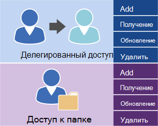

# Управление доступом пользователей с помощью веб-служб Exchange в ExchangeManaging user access by using EWS in Exchange

Узнайте, какие существуют возможности для управления доступом к учетной записи пользователя с сервером Exchange.Find out what your options are for managing user account access to your Exchange server.
  
Веб-служб Exchange (EWS) и веб-служб Exchange с управляемым API предоставляют ограниченное количество операций, которые можно использовать для управления учетными записями в Exchange Online, Exchange Online в составе Office 365 или версии Exchange, начиная с Exchange 2013.Exchange Web Services (EWS) and the EWS managed API provide a limited number of operations that you can use to manage accounts on Exchange Online, Exchange Online as part of Office 365, or a version of Exchange starting with Exchange 2013. Управление представителями и задавать права доступа к папкам для других учетных записей можно использовать операции, показано на следующем рисунке.You can use the operations shown in the following figure to manage delegates and to set folder access permissions for other accounts. 
  
**Операции веб-служб Exchange для доступа делегата и папки****EWS operations for delegate and folder access**

  
Если приложению дополнительные контроль учетных записей на сервере Exchange, можно использовать командлеты командной консоли Exchange к управлению учетными записями.If your application needs additional control over the accounts on an Exchange server, you can use Exchange Management Shell cmdlets to manage the accounts. Можно вызвать командлетов командной консоли Exchange, выполнив одно из следующих:You can call the Exchange Management Shell cmdlets by doing one of the following:
  
- Создание приложения с помощью C# или Visual Basic, который вызывает командлетов командной консоли Exchange.Writing an application using C# or Visual Basic that calls the Exchange Management Shell cmdlets. Можно просмотреть пример кода на [Документация по API -интерфейса командной консоли управления Exchange](../management/exchange-management-shell.md) , чтобы узнать, как для вызова командлета.You can look at the sample code in the [Exchange Management Shell API documentation](../management/exchange-management-shell.md) to learn how to call a cmdlet. 
    
- С помощью Windows PowerShell и сценарии Windows PowerShell для вызова командлетов командной консоли Exchange.Using Windows PowerShell and Windows PowerShell scripts to call Exchange Management Shell cmdlets. Можно найти полный список [Exchange Server PowerShell (Командная консоль Exchange)](https://docs.microsoft.com/en-us/powershell/exchange/exchange-server/exchange-management-shell?view=exchange-ps), а также примеры, показывающие, как их использовать.You can find a complete list of the [Exchange Server PowerShell (Exchange Management Shell)](https://docs.microsoft.com/en-us/powershell/exchange/exchange-server/exchange-management-shell?view=exchange-ps), along with examples that show how to use them. 
    
## См. такжеSee also

- [Настройка приложения веб-служб ExchangeSetting up your EWS application](setting-up-your-ews-application.md)   
- [Командлеты Exchange 2013Exchange 2013 Cmdlets](https://docs.microsoft.com/en-us/powershell/exchange/?view=exchange-ps)  
    

