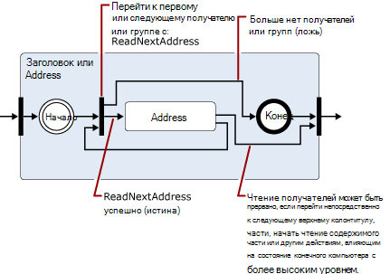
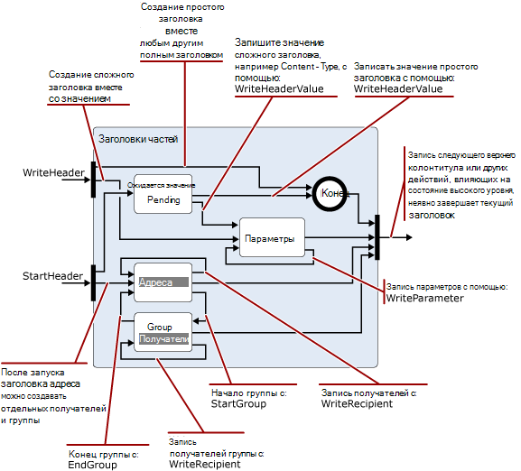

# Чтение и изменение сообщений в транспортном конвейере Exchange 2013

Сведения о классах .NET Framework, которые можно использовать в агентах транспорта Exchange 2013 для чтения, записи и изменения сообщений.
  
**Применимо к:** Exchange Server 2013
  
- Классы, используемые для чтения, записи и изменения сообщений
- Пространство имен кодировщиков
- пространство имен iCalendar
- Пространство имен MIME
- Пространство имен Текстконвертерс
- Пространство имен TNEF
- пространство имен vCard
  
Так как сообщения проходят через транспортный конвейер, агент транспорта может читать, записывать и преобразовывать содержимое сообщений между различными форматами данных. Например, вы можете просматривать и записывать данные MIME, определять входящие сообщения, которые находятся в Ууенкодед или в формате, поддерживающем возможность печати (QP), а затем преобразовывать их в стандарт, используемый вашей организацией, а также считывать и сохранять календарь или контактные данные, связанные с входящими сообщениями. 
  
Кроме того, можно определить содержимое, которое представляет угрозу безопасности и переместить или удалить содержимое или сообщения, содержащие их; Например, удалив ссылки в HTML-сообщении.
  
В этой статье представлены сведения о классах .NET Framework, которые можно использовать для чтения, записи и изменения сообщений.
  
> [!CAUTION]
> Многие свойства и параметры в API преобразования контента позволяют иметь большие значения, чтобы вызывать проблемы с производительностью, в том числе отказ в обслуживании. При использовании API преобразования контента в агенте транспорта следует реализовать ограничения для размеров свойств и значений параметров, которые поддерживаются при чтении или записи, чтобы ограничить потребление ресурсов агентом. 

## Классы, используемые для чтения, записи и изменения сообщений

В следующей таблице перечислены классы .NET Framework, которые можно использовать для чтения, записи и изменения сообщений электронной почты.
  
**Пространства имен обработки сообщений .NET Framework**

|**Пространство имен .NET Framework**|**занятия**;|
|:-----|:-----|
|[Microsoft. Exchange. Data. MIME. Encoders](https://msdn.microsoft.com/library/Microsoft.Exchange.Data.Mime.Encoders.aspx)   |Содержит классы для кодирования и декодирования в памяти, класс потока кодировщика, который принимает один из классов кодировщика или декодера, содержащийся в связанном перечислении, а также базовый класс [битинкодер](https://msdn.microsoft.com/library/Microsoft.Exchange.Data.Mime.Encoders.ByteEncoder.aspx) и класс исключения [битинкодерексцептион](https://msdn.microsoft.com/library/Microsoft.Exchange.Data.Mime.Encoders.ByteEncoderException.aspx) для кодировщиков и декодеров.    |
|[Microsoft. Exchange. Data. ContentTypes. iCalendar](https://msdn.microsoft.com/library/Microsoft.Exchange.Data.ContentTypes.iCalendar.aspx)   |Содержит типы, которые позволяют считывать и записывать потоки данных, содержащие сведения о календаре. Включает средство чтения и записи календаря, объект Exception, объект повторения, а также структуры и перечисления, которые помогают возвращать сведения о свойствах элементов календаря.    |
|[Microsoft. Exchange. Data. MIME](https://msdn.microsoft.com/library/Microsoft.Exchange.Data.Mime.aspx)   |Содержит классы, структуры, перечисления и делегаты, которые можно использовать для создания, чтения, записи, перебора, кодирования и декодирования данных MIME. Включает модуль чтения и записи на основе потоков, обеспечивающий прямой доступ для чтения и записи к потокам данных MIME, а также методы и классы на основе модели DOM, которые можно использовать в документах MIME.    |
|[Microsoft. Exchange. Data. Текстконвертерс](https://msdn.microsoft.com/library/Microsoft.Exchange.Data.TextConverters.aspx)   |Содержит классы, структуры, перечисления и делегаты, которые позволяют считывать и записывать поток данных, а также выполнять преобразования между определенными типами данных; Например, HTML-текст в формате RTF. Текстовые конвертеры позволяют изменять формат потока документов из одной формы в другую, а также выборочно удалять элементы документа, которые могут представлять угрозу безопасности.    |
|[Microsoft. Exchange. Data. ContentTypes. TNEF](https://msdn.microsoft.com/library/Microsoft.Exchange.Data.ContentTypes.Tnef.aspx)   |Содержит однонаправленный поток чтения и записи, класс Exception и структуры и перечисления, которые упрощают чтение и запись данных в формате TNEF.    |
|[Microsoft. Exchange. Data. ContentTypes. vCard](https://msdn.microsoft.com/library/Microsoft.Exchange.Data.ContentTypes.vCard.aspx)   |Содержит однонаправленный поток чтения и записи, класс Exception и структуры и перечисления, которые упрощают чтение и запись контактных данных в формате vCard.    |
   
## Пространство имен кодировщиков

Пространство имен кодировщиков содержит классы для кодирования и декодирования в памяти. Они наследуются от базового класса [битинкодер](https://msdn.microsoft.com/library/Microsoft.Exchange.Data.Mime.Encoders.ByteEncoder.aspx) . Классы шифруются и декодируются для Base64, BinHex, QUOTED-Printing (QP) и Unix-to-Unix (uu). Для кодирования и декодирования в памяти используются следующие классы: 
  
- [Base64Encoder](https://msdn.microsoft.com/library/Microsoft.Exchange.Data.Mime.Encoders.Base64Encoder.aspx)
    
- [Base64Decoder](https://msdn.microsoft.com/library/Microsoft.Exchange.Data.Mime.Encoders.Base64Decoder.aspx)
    
- [бинхексенкодер](https://msdn.microsoft.com/library/Microsoft.Exchange.Data.Mime.Encoders.BinHexEncoder.aspx)
    
- [бинхексдекодер](https://msdn.microsoft.com/library/Microsoft.Exchange.Data.Mime.Encoders.BinHexDecoder.aspx)
    
- [кпенкодер](https://msdn.microsoft.com/library/Microsoft.Exchange.Data.Mime.Encoders.QPEncoder.aspx)
    
- [кпдекодер](https://msdn.microsoft.com/library/Microsoft.Exchange.Data.Mime.Encoders.QPDecoder.aspx)
    
- [ууенкодер](https://msdn.microsoft.com/library/Microsoft.Exchange.Data.Mime.Encoders.UUEncoder.aspx)
    
- [уудекодер](https://msdn.microsoft.com/library/Microsoft.Exchange.Data.Mime.Encoders.UUDecoder.aspx)
    
Кодировщики и декодеры наследуются от базового класса [битинкодер](https://msdn.microsoft.com/library/Microsoft.Exchange.Data.Mime.Encoders.ByteEncoder.aspx) и используют класс исключения [битинкодерексцептион](https://msdn.microsoft.com/library/Microsoft.Exchange.Data.Mime.Encoders.ByteEncoderException.aspx) для обработки ошибок. 
  
Кроме того, пространство имен содержит класс [макбинарихеадер](https://msdn.microsoft.com/library/Microsoft.Exchange.Data.Mime.Encoders.MacBinaryHeader.aspx) , который определяет файлы, закодированные макбинари, и считывает связанный с ними заголовок файла. 
  
Наконец, класс [енкодерстреам](https://msdn.microsoft.com/library/Microsoft.Exchange.Data.Mime.Encoders.EncoderStream.aspx) выполняет преобразование для потока данных вместо объекта в памяти. Этот класс принимает один из классов кодировщика или декодера и либо считывает, либо выполняет запись в соответствии с соответствующим перечислением [енкодерстреамакцесс](https://msdn.microsoft.com/library/Microsoft.Exchange.Data.Mime.Encoders.EncoderStreamAccess.aspx) . 
  
## пространство имен iCalendar

Пространство имен iCalendar предоставляет только прямые средства чтения и записи для данных iCalendar, а также вспомогательные структуры и классы для создания, доступа и изменения потоков iCalendar.
  
Классы [календарреадер](https://msdn.microsoft.com/library/Microsoft.Exchange.Data.ContentTypes.iCalendar.CalendarReader.aspx) и [календарвритер](https://msdn.microsoft.com/library/Microsoft.Exchange.Data.ContentTypes.iCalendar.CalendarWriter.aspx) используются для чтения и записи данных потока iCalendar. 
  
Календарреадер принимает в качестве аргумента в конструкторе [поток](https://msdn.microsoft.com/library/System.IO.Stream.aspx) , доступный для чтения. Затем можно использовать методы [реадфирстчилдкомпонент](https://msdn.microsoft.com/library/Microsoft.Exchange.Data.ContentTypes.iCalendar.CalendarReader.ReadFirstChildComponent.aspx), [реаднекстсиблингкомпонент](https://msdn.microsoft.com/library/Microsoft.Exchange.Data.ContentTypes.iCalendar.CalendarReader.ReadNextSiblingComponent.aspx)и [реаднексткомпонент](https://msdn.microsoft.com/library/Microsoft.Exchange.Data.ContentTypes.iCalendar.CalendarReader.ReadNextComponent.aspx) для последовательного доступа к компонентам iCalendar в потоке данных. В зависимости от значения, заданного для свойства [комплианцемоде](https://msdn.microsoft.com/library/Microsoft.Exchange.Data.ContentTypes.iCalendar.CalendarReader.ComplianceMode.aspx) , ошибки в потоке iCalendar приведут к возникновению исключения или приводят к тому, что свойству [комплианцестатус](https://msdn.microsoft.com/library/Microsoft.Exchange.Data.ContentTypes.iCalendar.CalendarReader.ComplianceStatus.aspx) будет присвоено значение, отличное от " [совместимо](https://msdn.microsoft.com/en-us/library/microsoft.exchange.data.contenttypes.icalendar.calendarcompliancestatus.aspx)". Это свойство можно проверить, чтобы выявить проблемы с входящими данными iCalendar. 
  
Класс [календарвритер](https://msdn.microsoft.com/library/Microsoft.Exchange.Data.ContentTypes.iCalendar.CalendarWriter.aspx) принимает [поток](https://msdn.microsoft.com/library/System.IO.Stream.aspx) , доступный для записи, в качестве аргумента для его конструкторов. 
  
## Пространство имен MIME

Пространство имен MIME содержит классы, позволяющие создавать и изменять документы MIME, а также получать к ним доступ. Для работы с документами MIME можно использовать метод на основе потока или на основе модели DOM.
  
### Класс Мимедокумент и модель DOM MIME

Класс [мимедокумент](https://msdn.microsoft.com/library/Microsoft.Exchange.Data.Mime.MimeDocument.aspx) обеспечивает DOM MIME для доступа к документу MIME. Используйте объекты этого типа, если у вас есть доступная память для загрузки всей модели DOM и у вас должен быть произвольный доступ к заголовкам и содержимому сообщения. 
  
Вы загружаете данные в объект [мимедокумент](https://msdn.microsoft.com/library/Microsoft.Exchange.Data.Mime.MimeDocument.aspx) с помощью методов [жетлоадстреам](https://msdn.microsoft.com/library/Microsoft.Exchange.Data.Mime.MimeDocument.GetLoadStream.aspx) или [Load](https://msdn.microsoft.com/library/Microsoft.Exchange.Data.Mime.MimeDocument.Load.aspx) . Затем вы можете проанализировать иерархию DOM и создать, изменить или удалить данные MIME. После изменения данных MIME можно записать их в поток с помощью одного из методов [вритето](https://msdn.microsoft.com/library/Microsoft.Exchange.Data.Mime.MimeNode.WriteTo.aspx) . 
  
На следующем рисунке показана структура данных в объекте [мимедокумент](https://msdn.microsoft.com/library/Microsoft.Exchange.Data.Mime.MimeDocument.aspx) . 
  
**Рис. 1. Структура объектов Мимедокумент**

  
### Классы Мимереадер и MimeWriter и синтаксический анализ MIME на основе потоков

Классы [мимереадер](https://msdn.microsoft.com/library/Microsoft.Exchange.Data.Mime.MimeReader.aspx) и [MimeWriter](https://msdn.microsoft.com/library/Microsoft.Exchange.Data.Mime.MimeWriter.aspx) обеспечивают прямой доступ к потокам MIME. Используйте эти классы, если нет необходимости изменять данные MIME, требующие уже прочитанных или записанных данных. Например, если требуется напечатать сообщения, соответствующие предварительно определенному формату, класс [MimeWriter](https://msdn.microsoft.com/library/Microsoft.Exchange.Data.Mime.MimeWriter.aspx) может быть идеальным. 
  
Класс [мимедокумент](https://msdn.microsoft.com/library/Microsoft.Exchange.Data.Mime.MimeDocument.aspx) инкапсулирует модель DOM. Классы [мимереадер](https://msdn.microsoft.com/library/Microsoft.Exchange.Data.Mime.MimeReader.aspx) и [MimeWriter](https://msdn.microsoft.com/library/Microsoft.Exchange.Data.Mime.MimeWriter.aspx) представляют компьютеры состояния. Их состояния изменяются в зависимости от полученных входных данных и вызываемых методов. Рисунки 2 – 5 — это упрощенные схемы перехода между состояниями, [MimeReader](https://msdn.microsoft.com/library/Microsoft.Exchange.Data.Mime.MimeReader.aspx) которые показывают, что методы являются допустимыми для вызова из каждого состояния, и состояние, которое будет результатом. 
  
Чтобы использовать эти схемы, следуйте стрелкам из одного состояния в следующий, указывая, что метод вызывает или возвращает значения, которые приводят к изменению состояния. Например, на первой схеме предполагается, что вы в начале потока, принадлежащего созданному Мимереадер. Чтобы перейти к состоянию заголовков частей, вызовите один из [реаднекстпарт](https://msdn.microsoft.com/library/Microsoft.Exchange.Data.Mime.MimeReader.ReadNextPart.aspx) или [реадфирстчилдпарт](https://msdn.microsoft.com/library/Microsoft.Exchange.Data.Mime.MimeReader.ReadFirstChildPart.aspx)в указанном порядке. Если есть заголовки (то есть, если MIME имеет правильный формат), вы будете переходить к состоянию заголовков частей. В противном случае будет создано исключение. 
  
**Рис. 2. Упрощенная схема переходов состояний для объектов Мимереадер**

  
> [!NOTE]
> Рисунки 3, 4 и 5 разворачиваются по состояниям, отображаемым на каждой из предыдущих схем. 
  
**Рис. 3. Расширение состояния заголовков частей на рисунке 2**

  
**На рисунке 4. Расширение состояния заголовка с рисунка 3 при обнаружении параметра в заголовке**

  
> [!NOTE]
> Состояние, представленное на рисунке 5, является рекурсивным в том, что при обнаружении группы адресов можно использовать свойство [граупреЦипиентреадер](https://msdn.microsoft.com/library/Microsoft.Exchange.Data.Mime.MimeAddressReader.GroupRecipientReader.aspx) для чтения адресов в группе. 
  
**На рисунке 5. Расширение состояния заголовка с рисунка 3 при обнаружении адреса или группы адресов**

  
На рисунках 6 и 7 показана упрощенная схема переходов состояний для объекта [MimeWriter](https://msdn.microsoft.com/library/Microsoft.Exchange.Data.Mime.MimeWriter.aspx) . 
  
> [!NOTE]
> На рисунке 7 разворачиваются состояния заголовков частей, показанные на рисунке 6. 
  
**На рисунке 6. Упрощенная схема переходов состояний для объектов MimeWriter**

  
**На рисунке 7. Расширение состояния заголовков частей на рисунке 6**

  
## Пространство имен Текстконвертерс

Пространство имен Текстконвертерс содержит типы, поддерживающие преобразование содержимого сообщений электронной почты. Эти типы могут выполнять преобразование кодовых страниц, удалять незащищенный HTML-код и выполнять другие преобразования в теле сообщений электронной почты. Пространство имен [Microsoft. Exchange. Data. текстконвертерс](https://msdn.microsoft.com/library/Microsoft.Exchange.Data.TextConverters.aspx) включает следующие классы, производные от абстрактного класса [текстконвертер](https://msdn.microsoft.com/library/Microsoft.Exchange.Data.TextConverters.TextConverter.aspx) : 
  
- [енричедтохтмл](https://msdn.microsoft.com/library/Microsoft.Exchange.Data.TextConverters.EnrichedToHtml.aspx)
    
- [енричедтотекст](https://msdn.microsoft.com/library/Microsoft.Exchange.Data.TextConverters.EnrichedToText.aspx)
    
- [хтмлтоенричед](https://msdn.microsoft.com/library/Microsoft.Exchange.Data.TextConverters.HtmlToEnriched.aspx)
    
- [хтмлтохтмл](https://msdn.microsoft.com/library/Microsoft.Exchange.Data.TextConverters.HtmlToHtml.aspx)
    
- [хтмлтортф](https://msdn.microsoft.com/library/Microsoft.Exchange.Data.TextConverters.HtmlToRtf.aspx)
    
- [хтмлтотекст](https://msdn.microsoft.com/library/Microsoft.Exchange.Data.TextConverters.HtmlToText.aspx)
    
- [ртфкомпресседтортф](https://msdn.microsoft.com/library/Microsoft.Exchange.Data.TextConverters.RtfCompressedToRtf.aspx)
    
- [ртфтохтмл](https://msdn.microsoft.com/library/Microsoft.Exchange.Data.TextConverters.RtfToHtml.aspx)
    
- [ртфтортф](https://msdn.microsoft.com/library/Microsoft.Exchange.Data.TextConverters.RtfToRtf.aspx)
    
- [ртфтортфкомпрессед](https://msdn.microsoft.com/library/Microsoft.Exchange.Data.TextConverters.RtfToRtfCompressed.aspx)
    
- [ртфтотекст](https://msdn.microsoft.com/library/Microsoft.Exchange.Data.TextConverters.RtfToText.aspx)
    
- [тексттохтмл](https://msdn.microsoft.com/library/Microsoft.Exchange.Data.TextConverters.TextToHtml.aspx)
    
- [тексттортф](https://msdn.microsoft.com/library/Microsoft.Exchange.Data.TextConverters.TextToRtf.aspx)
    
- [тексттотекст](https://msdn.microsoft.com/library/Microsoft.Exchange.Data.TextConverters.TextToText.aspx)
    
Эти текстовые конвертеры позволяют изменять формат потока документов или удалять элементы, которые не защищены от HTML-документа. Эти классы могут использоваться самостоятельно для выполнения преобразования с помощью одного вызова одного из методов Convert в базовом классе [текстконвертер](https://msdn.microsoft.com/library/Microsoft.Exchange.Data.TextConverters.TextConverter.aspx) , или они могут передаваться конструктору преобразователя, который использует его для выполнения преобразованных операций чтения или записи. 
  
Функция, унаследованная от базового класса, полезна для выполнения преобразований при наличии достаточного места для хранения исходного документа и его преобразованных выходных данных, а также при необходимости сохранения результатов преобразования. Метод **Convert** использует потоки входных и выходных данных, средства чтения текста и средства записи текста, а также преобразует содержимое входных данных в связанные выходные данные. 
  
Кроме того, в пространство имен включены следующие классы текстовых средств чтения, записи и потока:
  
- [Конвертерреадер](https://msdn.microsoft.com/library/Microsoft.Exchange.Data.TextConverters.ConverterReader.aspx) — является производным от **System. IO. TextReader**. 
    
- [Конвертервритер](https://msdn.microsoft.com/library/Microsoft.Exchange.Data.TextConverters.ConverterWriter.aspx) — производный от **System. IO. TextWriter**. 
    
- [Конвертерстреам](https://msdn.microsoft.com/library/Microsoft.Exchange.Data.TextConverters.ConverterStream.aspx) — является производным от **System. IO. Stream**. 
    
Они используются для выполнения преобразований, когда у вас нет места для хранения исходного или его преобразованного выхода, когда вы получаете входные данные из потока или отправляете их в поток, или если вы хотите выводить результаты только для индексирования или поиска.
  
## Пространство имен TNEF

Пространство имен TNEF содержит классы и типы, обеспечивающие однонаправленный Просмотр и запись данных TNEF на основе потоков. TNEF — это формат данных, используемый для инкапсуляции свойств MAPI для клиентов, которые не могут интерпретировать MAPI.
  
Классы [тнефреадер](https://msdn.microsoft.com/library/Microsoft.Exchange.Data.ContentTypes.Tnef.TnefReader.aspx) и [тнефвритер](https://msdn.microsoft.com/library/Microsoft.Exchange.Data.ContentTypes.Tnef.TnefWriter.aspx) предоставляют основные функциональные возможности в пространстве имен [Microsoft. Exchange. Data. ContentTypes. TNEF](https://msdn.microsoft.com/library/Microsoft.Exchange.Data.ContentTypes.Tnef.aspx) . 
  
Класс [тнефреадер](https://msdn.microsoft.com/library/Microsoft.Exchange.Data.ContentTypes.Tnef.TnefReader.aspx) принимает в качестве аргумента в конструкторе поток, доступный для чтения. Затем используйте метод [реаднекстаттрибуте](https://msdn.microsoft.com/library/Microsoft.Exchange.Data.ContentTypes.Tnef.TnefReader.ReadNextAttribute.aspx) для последовательного чтения атрибутов в потоке TNEF. После считывания атрибута можно получить доступ к сведениям об атрибуте, используя любое из доступных только для чтения свойств объекта [тнефреадер](https://msdn.microsoft.com/library/Microsoft.Exchange.Data.ContentTypes.Tnef.TnefReader.aspx) , а также получение [тнефпропертиреадер](https://msdn.microsoft.com/library/Microsoft.Exchange.Data.ContentTypes.Tnef.TnefPropertyReader.aspx) для чтения текущего свойства. Вы также можете напрямую получить доступ к текущему атрибуту с помощью метода [реадаттрибутераввалуе](https://msdn.microsoft.com/library/Microsoft.Exchange.Data.ContentTypes.Tnef.TnefReader.ReadAttributeRawValue.aspx) . 
  
Класс [тнефвритер](https://msdn.microsoft.com/library/Microsoft.Exchange.Data.ContentTypes.Tnef.TnefWriter.aspx) принимает [поток](https://msdn.microsoft.com/library/System.IO.Stream.aspx) , доступный для записи, в качестве аргумента для его конструкторов. Класс [тнефвритер](https://msdn.microsoft.com/library/Microsoft.Exchange.Data.ContentTypes.Tnef.TnefWriter.aspx) предоставляет несколько способов записи данных в этот поток. 
  
## пространство имен vCard

Пространство имен vCard содержит классы, структуры и перечисления, которые используются для чтения и записи контактных данных, содержащихся в сообщении электронной почты в формате vCard. Пространство имен содержит средства чтения и записи контакта, класс Exception, средство чтения свойств, средство чтения параметров и вспомогательные перечисления, позволяющие считывать данные vCard, связанные с сообщением электронной почты.
  
## См. также

- [Агенты транспорта в Exchange](transport-agents-in-exchange-2013.md)  
- [Основные понятия, связанные с агентами транспорта в Exchange 2013](transport-agent-concepts-in-exchange-2013.md) 
- [Справочник по агентам транспорта для Exchange 2013](transport-agent-reference-for-exchange-2013.md)
- [Типы мультимедиа MIME](http://www.iana.org/assignments/media-types)
    

